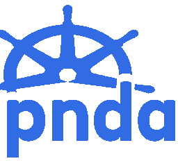

# cloud-pnda Helm Chart

**cloud-pnda is under active development and is not suited for production use.**



## Overview

This repo maintains the source code of the cloud-pnda helm chart and some auxiliary files such as example override yaml files (profiles) and grafana-dashboards.
cloud-pnda helm chart enables you to deploy PNDA (the scalable, open source big data analytics platform for networks and services) on Kubernetes.

It deploys [PNDA components](cloud-pnda/templates) and [Big Data Requirements](cloud-pnda/charts). 

A helm client uses the cloud-native helm chart to deploy PNDA platform on Kubernetes. 
Default configuration values can be overriden providing an external yaml file (See [Configuration Section](#Configuration)).

### Requirements

Tested with:

- Kubernetes v1.15
- Helm v2.15

## Deploy from Source

If you install cloud-pnda chart from source you must first update its dependecies with:
```
helm dep update charts/cloud-pnda
```

Then proceed with the helm install:
```
helm install --name pnda charts/cloud-pnda/
```


## Configuration

PNDA is configured by default for minimum resource requirements (for example HA is disabled by default).

To override default configuration values, the user must provide a yaml file in the helm install command:

```
helm install --name pnda charts/cloud-pnda/ -f custom-config.yaml
```
 
This repository contains several custom configuration examples in *profiles* folder with several pnda custom deployments:
- [profiles/red-pnda.yml](profiles/red-pnda.yml): profile to deploy pnda in a single computer for development purposes.
- [profiles/pico.yml](profiles/pico.yml): profile to deploy pnda in a cluster with minimum resources.
- *More to be added*.

The default values of [PNDA components](charts/cloud-pnda/templates) and [Big Data dependencies](charts/cloud-pnda/requirements.yaml) can be checked at [charts/cloud-pnda/values.yaml](charts/cloud-pnda/values.yaml) file.

For configuration of the [Big Data requirements](cloud-pnda/requirements.yaml) you should inspect the values.yaml of the corresponding chart. Here is a list of the requirements and the location of their charts:
- hdfs (this repo): [values.yaml](charts/hdfs/values.yaml).
- hbase (this repo): [values.yaml](charts/hbase/values.yaml).
- openstsdb (this repo): [values.yaml](charts/opentsdb/values.yaml).
- spark-standalone (this repo): [values.yaml](charts/spark-standalone/values.yaml).
- jupyterhub (jupyterhub repo): [values.yaml](https://github.com/jupyterhub/zero-to-jupyterhub-k8s/blob/master/jupyterhub/values.yaml).
- cp-zookeeper (confluent repo): [values.yaml](https://github.com/confluentinc/cp-helm-charts/blob/master/charts/cp-zookeeper/values.yaml).
- cp-kafka (confluent repo): [values.yaml](https://github.com/confluentinc/cp-helm-charts/blob/master/charts/cp-kafka/values.yaml).


## Deploy from PNDA helm repository

The helm repository [https://pndaproject.github.io/pnda-helm-repo/](https://pndaproject.github.io/pnda-helm-repo/) provides packaged helm charts of this repo releases.

Please follow the instructions at the pnda helm repository to deploy from a packaged chart.

## Tutorials

We have created several step-by-step tutorials to deploy pnda in several types of kubernetes clusters:

- [Minikube tutorial](tutorials/minikube.md).
- [Microk8s tutorial](tutorials/microk8s.md).

## Credits

- [Zero to Jupyterhub with Kubernetes](https://zero-to-jupyterhub.readthedocs.io/en/latest/)
- [Confluent Platform helm chart](https://github.com/confluentinc/cp-helm-charts)
